# Network Segmentation & Secure Smart-Home Lab (pfSense + Home Assistant + MQTT)

## Context (ASIR Final Project)
This project designs and implements a segmented smart-home lab environment to reduce attack surface and contain IoT risks using VLAN-based segmentation and pfSense firewalling, with Home Assistant as the automation platform and Mosquitto (MQTT) for IoT messaging.

> Public version note: this repository is sanitized for publication (no real passwords, keys, tokens, or identifiable production data).

---

## Target Roles (What this demonstrates)
**System Administration**
- Service deployment and configuration (Linux VM, MQTT broker, Home Assistant)
- Access control, secure remote administration patterns, configuration documentation

**Network Engineering**
- VLAN design, routing boundaries, DHCP scopes per segment
- Firewall policy design (default-deny, least privilege, controlled exceptions)
- Lab validation and troubleshooting methodology

**Cyber Blue Team / SOC**
- Segmentation as a security control (containment, lateral movement reduction)
- Security-focused validation (rule testing, traffic verification, evidence collection)
- Optional monitoring/logging extensions (see “Enhancements”)

---

## Architecture
**Segments**
- **Admin VLAN**: management and automation core (Home Assistant)
- **IoT VLAN**: IoT devices and MQTT broker
- **Guest VLAN**: Internet-only access with strict isolation

**Core Components**
- **pfSense**: inter-VLAN routing + firewall rules + DHCP per VLAN
- **Home Assistant**: automation and integrations
- **Mosquitto (MQTT)**: messaging layer for IoT (publish/subscribe)

## Screenshots (Evidence)

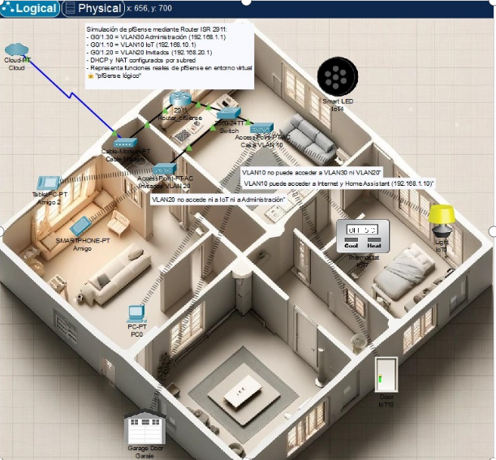

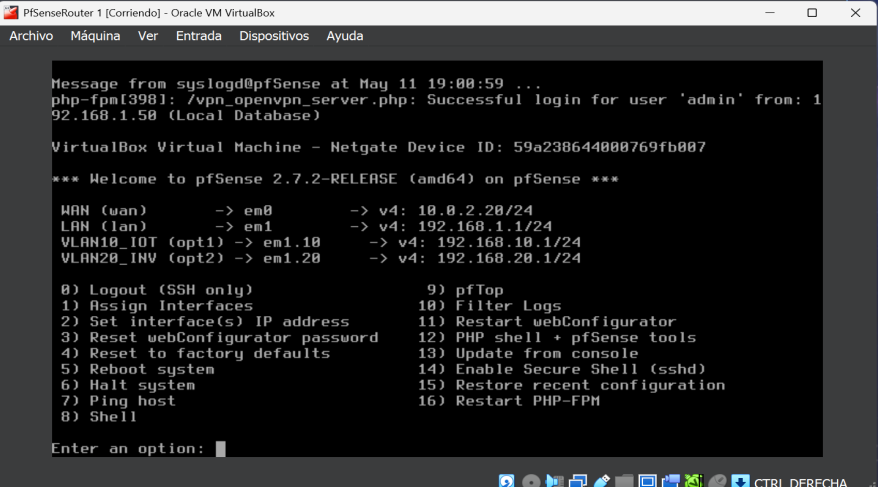
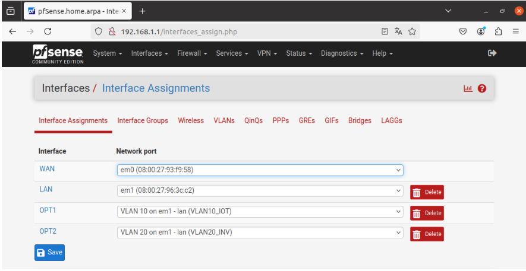

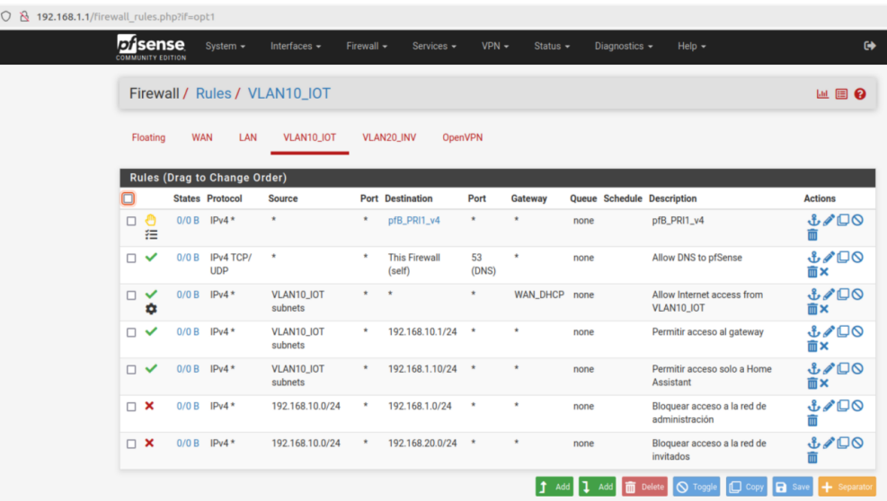
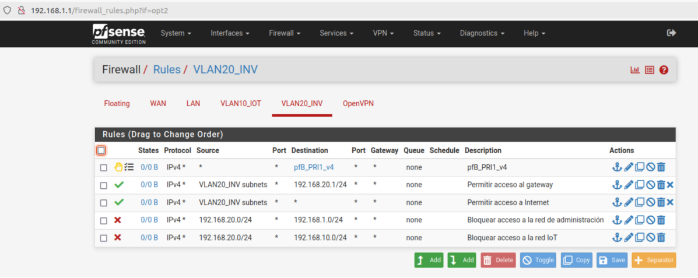

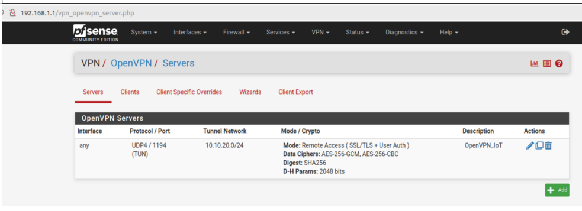
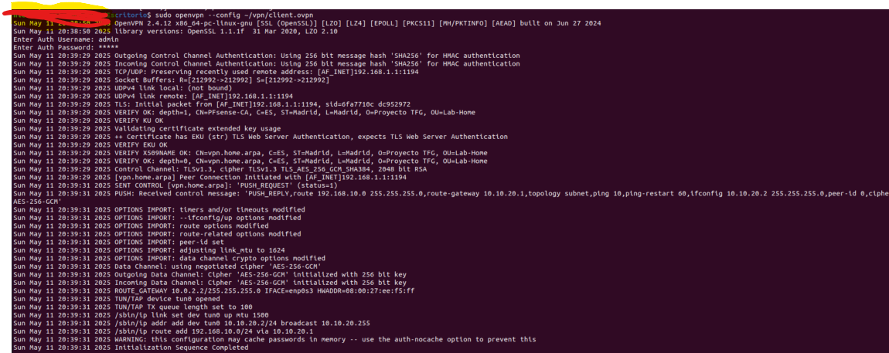

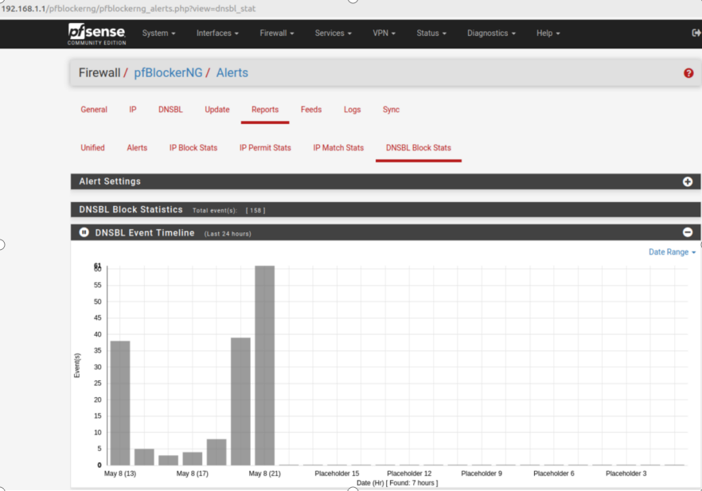

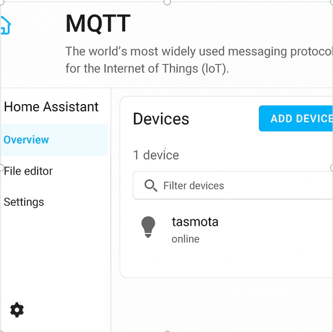
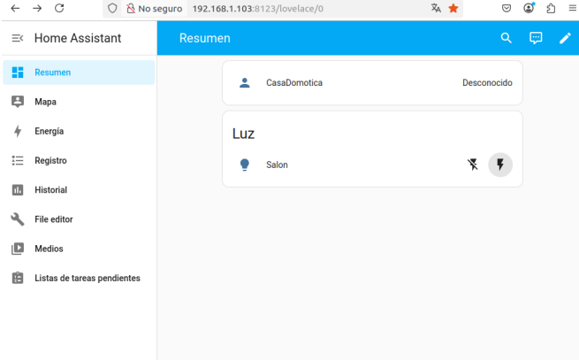
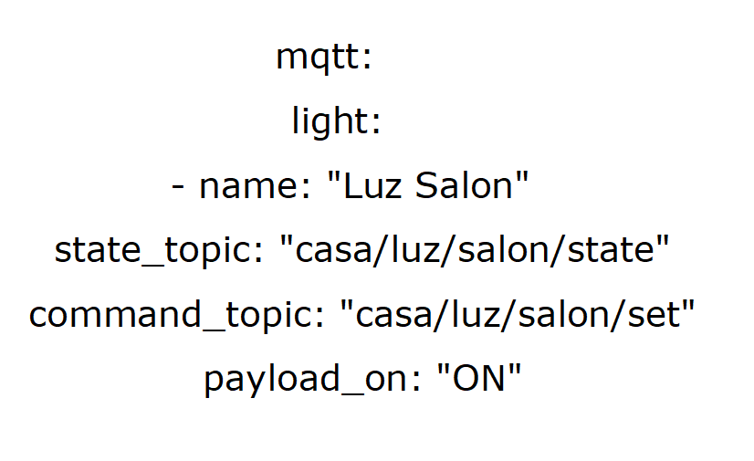

> Diagram and screenshots: see `/docs/`.

---

## Security Controls Implemented
- Network segmentation (separate trust zones for Admin / IoT / Guest)
- Default-deny policy between VLANs
- Explicit allow rules only for required services (least privilege)
- Guest isolation with Internet-only access
- Documented configuration approach (repeatable lab build)

---

## Validation / Evidence
- Inter-VLAN isolation verified (no lateral movement by default)
- Controlled exceptions tested (service reachability only where permitted)
- MQTT message flow tested with publish/subscribe
- Home Assistant automation verified via trigger/action tests

Evidence artifacts:
- Rule summaries and rationale: `/configs/pfsense/rules-summary.md`
- Test plan and results: `/docs/validation.md`
- Screenshots and diagrams: `/docs/`

---

## Repository Contents
- `/docs/` – Sanitized public report (PDF), diagrams, screenshots, validation tests
- `/configs/` – Example configurations (sanitized) and rule summaries
- `/src/` – Helper scripts or notes (optional)

---

## Quick Reproduction (High-Level)
1. Deploy **pfSense VM** (WAN NAT + LAN trunk)
2. Create VLAN interfaces for **Admin / IoT / Guest**
3. Configure **DHCP** per VLAN and **firewall rules** (default-deny + explicit allows)
4. Deploy **Home Assistant** on Admin VLAN
5. Deploy **Ubuntu VM + Mosquitto** on IoT VLAN
6. Validate with connectivity tests + MQTT publish/subscribe

---

## Enhancements (Roadmap / Next Iteration)
Suitable additions for a Blue Team / SOC track:
- Centralized logging (pfSense syslog → Linux/Graylog/ELK)
- IDS/IPS (Suricata on pfSense) + alert tuning
- DNS filtering / threat blocking (pfBlockerNG)
- Remote access hardening (OpenVPN/WireGuard + MFA where possible)
- Asset inventory + basic detection use-cases (IoT VLAN anomalies)

---

## Disclaimer
This lab is for educational purposes. Public configs are examples and sanitized.
